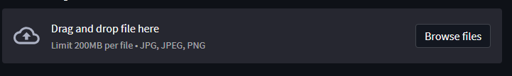
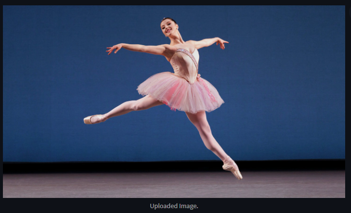
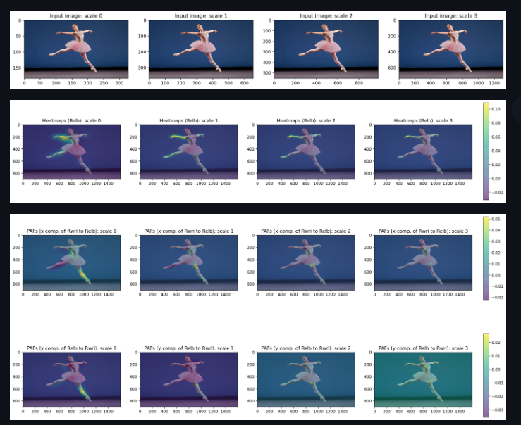
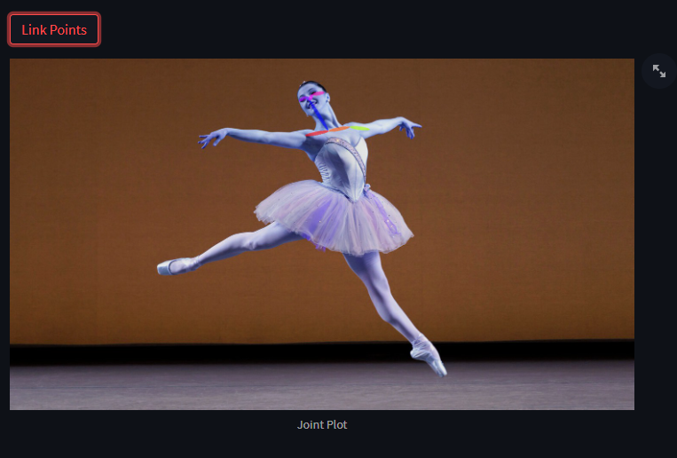

# COCOPoseTFLearn


## Installation and Setup Instructions

Follow these steps to set up the project environment:

1. **Initialize Windows Subsystem for Linux (WSL):**
   Launch the Windows Subsystem for Linux on your machine.

2. **Clone the Repository:**
   Using Git, clone the repository and open it in Visual Studio Code.

3. **Prepare the Datasets:**
   - Navigate to the datasets folder:
     ```
     cd datasets
     ```
   - Modify script permissions and download the dataset:
     ```
     chmod +x download_dataset.sh
     ./download_dataset.sh
     ```
   Note: The download process may take approximately 45 minutes. Ensure you have at least 25-30 GB of free space on your WSL instance.

4. **Create a Conda Environment:**
   Set up a new Conda environment named 'cv' with the required dependencies:
   ```
   conda create --name cv --file conda_requirements.txt
   ```

5. **Activate the Conda Environment:**
   Activate the newly created Conda environment:
   ```
   conda activate cv
   ```

6. **Install Additional Python Dependencies:**
   Install the required Python packages using pip:
   ```
   pip install -r requirements.txt
   ```

7. **Start the Training Process:**
   Initiate the training process by running the training script:
   ```
   python training/train_pose.py
   ```

8. **TensorBoard and Model Visualization:**
   During the training, a popup will prompt you to open TensorBoard in Visual Studio Code and provide an option to download PNGs of the model.


Certainly! I'll create a README document for your GUI application which involves installing Streamlit, running the Streamlit app, and using buttons to process an image, visualize body parts, and link points. You can add the image links later as needed.

---

# GUI Application Using Streamlit

This document provides instructions on how to set up and run the GUI version of our application, which is built using Streamlit. The GUI includes functionalities such as image processing, visualization of body parts, and linking points on the image.


## Running the Application

1. **Navigate to the Application Directory**: Change your directory to where the application is located:

   ```bash
   cd COCOPoseTFLearn
   ```

2. **Start the Streamlit App**: Run the following command to start the Streamlit app:

   ```bash
   streamlit run gui/streamlit_app.py
   ```

3. **Using the GUI**:
   
   - **Drop Image**: On the application interface, use the provided option to upload or drop your image for processing.

     
   
   - **Process Image**: Click on the 'Process Image' button to start the image processing.

     

   - **Visualize Body Parts**: After processing, use the 'Visualize Body Parts' button to see the body parts visualization.

     

   - **Link Points**: Finally, use the 'Link Points' button to connect points on the processed image.

     

